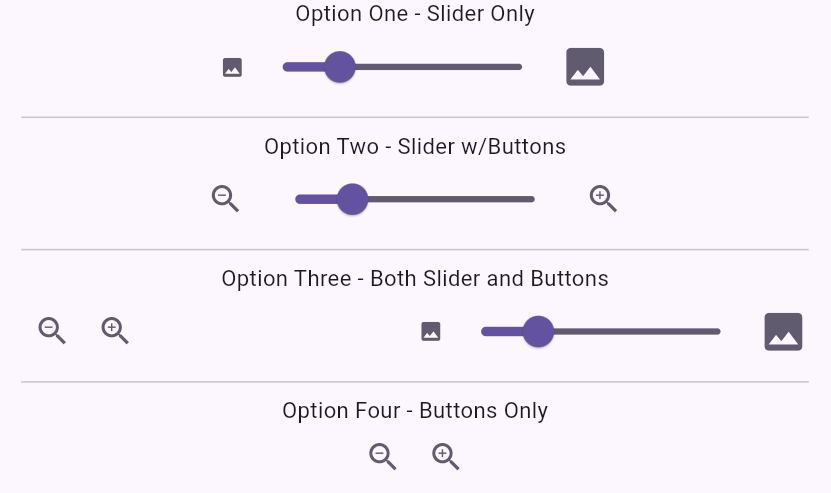

# Custom Zoom

## Usage

There are four display modes for the Zoom widget (Slider only, Slider with buttons, Buttons only, Slider and buttons separate). This is determined at time of instantiating the widget. Specific functions are required depending on which option is chosen.
These have also been pulled out to be below the image and not on top of it.

Examples:

## Issues

There is still a minor oddity. When moving the slider to the minimum position, then clicking zoom out button, the slider moves up slightly (more if a larger image). Might have something to do with DPI of the image.
